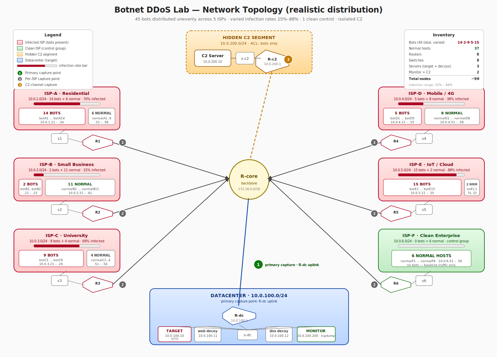
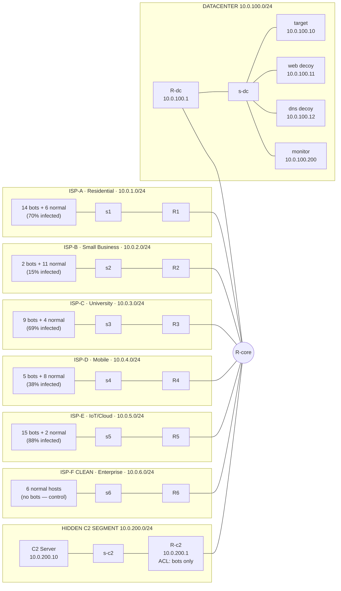
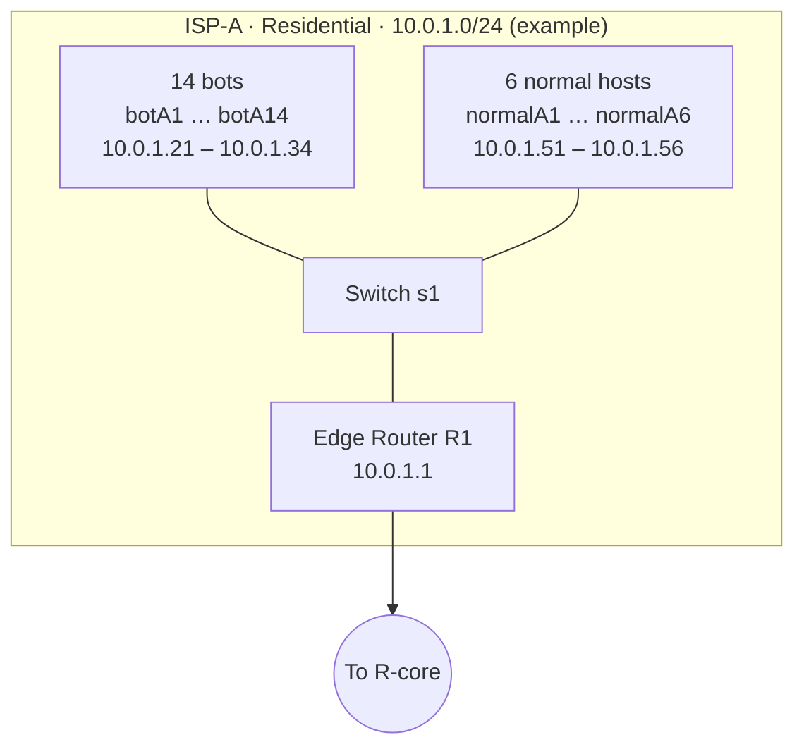
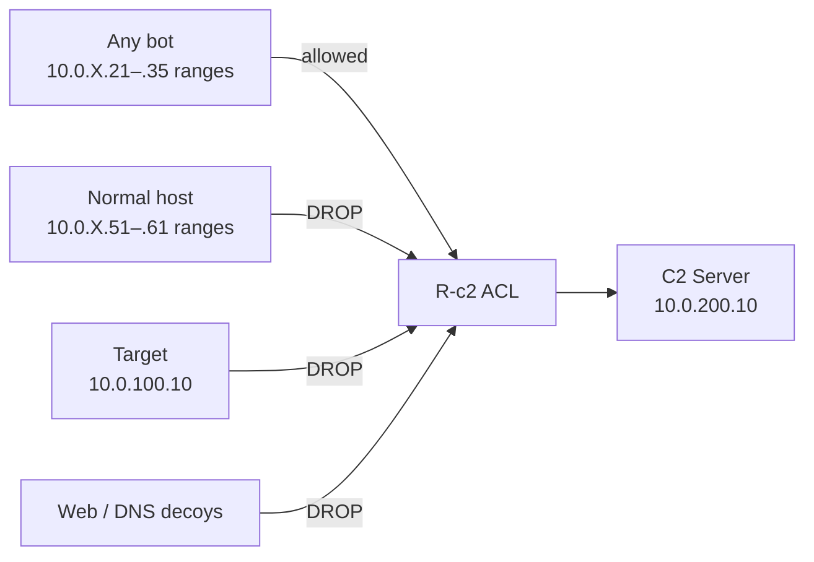
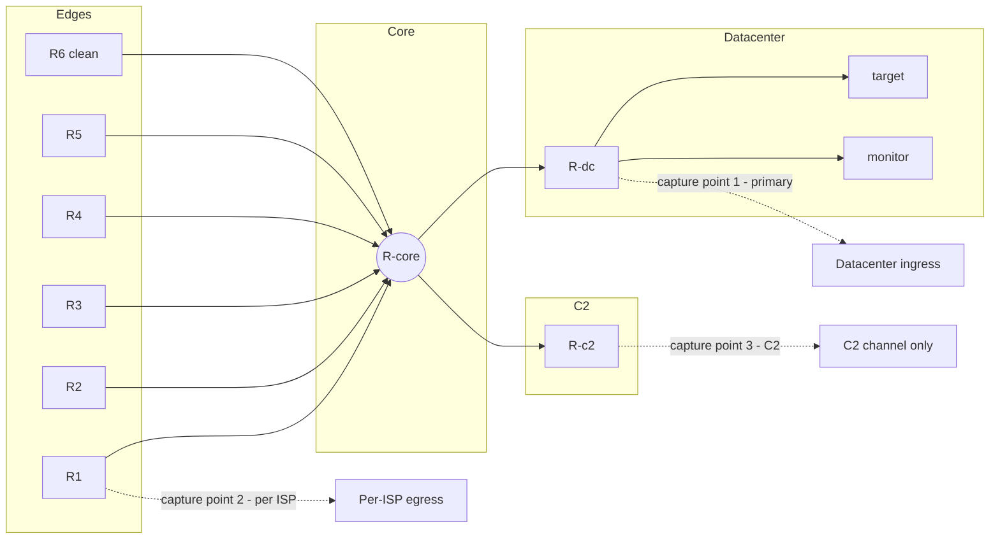

# Network Topology Design

> Behavioral Analysis and Detection of Simulated Botnet Based DDoS Traffic
> in a Controlled Virtual Environment

This document defines the virtual network topology used for the project.
It describes the structure, addressing, routing, and isolation strategy
for the C2 channel, and identifies the points where traffic capture will
take place.

---

## 1. Goals

The topology is designed to satisfy five requirements:

1. **Scale** — 45 bots in total, so that the captured dataset is large
   enough for meaningful behavioral analysis and detection.
2. **Realism** — bots must be distributed across multiple subnets to
   reproduce a realistic *many-to-one* DDoS pattern coming from
   geographically diverse sources.
3. **Heterogeneous population** — each infected subnet has a *different*
   number of bots, a *different* number of legitimate hosts, and a
   *different* infection rate. Real ISPs do not share an identical
   compromise profile; the dataset must reflect that.
4. **Mixed traffic** — every infected subnet contains legitimate hosts
   as well as bots, so that the captured traffic includes both normal
   and attack flows from the same source network.
5. **Hidden C2** — the command and control server must sit on its own
   isolated segment, unreachable from anything other than the bots,
   so that the C2 channel can be analyzed independently from the attack
   traffic.

---

## 2. High-level overview

The topology simulates a small Internet with five infected ISPs, one
clean ISP, a datacenter that hosts the victim, and a hidden C2 segment.
All inter-domain traffic transits through a core router.



The same topology is also expressed as a Mermaid diagram below
(equivalent content, useful for editing):



ASCII fallback diagram (for environments that do not render Mermaid):

```
                        ┌──────── HIDDEN C2 SEGMENT ────────┐
                        │   10.0.200.0/24                   │
                        │   ┌──────────────┐                │
                        │   │  C2 Server   │ 10.0.200.10    │
                        │   └──────┬───────┘                │
                        │       [s-c2]                      │
                        │          │                        │
                        │       [R-c2] 10.0.200.1           │
                        │          │  ◄── ACL: only bot IPs │
                        └──────────┼────────────────────────┘
                                   │
   ISP-A Residential               │             ISP-D Mobile
   10.0.1.0/24                     │             10.0.4.0/24
   ┌──────────────────────┐        │             ┌──────────────────────┐
   │ 14 bots + 6 normal   │─[s1]─[R1]─┐      ┌─[R4]─[s4]─│ 5 bots + 8 normal│
   │       70% infected   │           │      │           │   38% infected  │
   └──────────────────────┘           │      │           └──────────────────────┘
                                      ▼      ▼
                                   ┌────────────┐
   ISP-B Small Business             │            │           ISP-E IoT / Cloud
   10.0.2.0/24                      │   R-core   │           10.0.5.0/24
   ┌──────────────────────┐         │            │           ┌──────────────────────┐
   │ 2 bots + 11 normal   │─[s2]─[R2]─►        ◄─[R5]─[s5]─│ 15 bots + 2 normal│
   │       15% infected   │         │            │           │   88% infected  │
   └──────────────────────┘         └─────┬──────┘           └──────────────────────┘
                                       ▲      ▲
   ISP-C University                    │      │             ISP-F CLEAN Enterprise
   10.0.3.0/24                         │      │             10.0.6.0/24
   ┌──────────────────────┐            │      │             ┌──────────────────────┐
   │ 9 bots + 4 normal    │──[s3]──[R3]      [R6]──[s6]────│ 0 bots + 6 normal    │
   │       69% infected   │                                  │   control group      │
   └──────────────────────┘                                  └──────────────────────┘
                                       │
                                    [R-dc] 10.0.100.1   ◄── primary capture point
                                       │
                                    [s-dc]
                              ┌────────┼────────┬─────────────┐
                              │        │        │             │
                           target    web      dns          monitor
                         10.0.100.10 .11      .12          .200
                            (HTTP)
```

---

## 3. Inventory

### 3.1 Per-ISP composition

Each ISP is given a "character" that motivates its bot/normal ratio.
This is intentional: real ISPs have very different compromise profiles
depending on their user base, security posture, and device mix.

| ISP   | Character                                    | Bots | Normal | Total | Infection rate |
|-------|----------------------------------------------|-----:|-------:|------:|---------------:|
| ISP-A | Residential — many unpatched home users      |  14  |   6    |  20   |          70 %  |
| ISP-B | Small Business — well-managed network        |   2  |  11    |  13   |          15 %  |
| ISP-C | University — mixed student/staff devices     |   9  |   4    |  13   |          69 %  |
| ISP-D | Mobile / 4G — varied devices                 |   5  |   8    |  13   |          38 %  |
| ISP-E | IoT / Cloud — heavily compromised devices    |  15  |   2    |  17   |          88 %  |
| ISP-F | Enterprise (CLEAN) — control group, no bots  |   0  |   6    |   6   |           0 %  |
| **Sum** | —                                          | **45** | **37** | **82** |          —     |

Why varied rather than uniform:

- **Per-ISP detection** becomes meaningful — Person 5 can build a model
  that flags compromised LANs by their behavior alone.
- The 15 % infection rate of ISP-B stress-tests detection on lightly
  compromised networks where bots are a minority.
- The 88 % rate of ISP-E exercises the opposite extreme.
- Different host counts per LAN mean different baseline traffic
  volumes; detection cannot rely on raw packet count and must use rates
  and ratios.

### 3.2 Node totals

| Component         | Count   | Detail                                          |
|-------------------|---------|-------------------------------------------------|
| Bots              | **45**  | distributed unevenly across 5 infected ISPs     |
| Normal hosts      | **37**  | 31 in infected ISPs + 6 in clean ISP-F          |
| ISP routers       | 6       | R1–R6 (R6 = clean ISP)                          |
| Datacenter router | 1       | R-dc                                            |
| C2 router         | 1       | R-c2 (with ACL)                                 |
| Core router       | 1       | R-core                                          |
| Switches          | 8       | s1–s6, s-dc, s-c2                               |
| Servers           | 3       | target, web decoy, dns decoy                    |
| Monitor host      | 1       | inside datacenter                               |
| C2 server         | 1       | inside hidden segment                           |
| **Total nodes**   | **~99** | comfortably within Mininet limits               |

---

## 4. Per-ISP detail

Every ISP shares the same *structure* (a switch and an edge router),
but the number of bots and normal hosts on each switch is different.
The structure is shown below using ISP-A as an example; the other ISPs
follow the same shape with the host counts from section 3.1.



Naming convention: bots are named `bot<ISP-letter><index>` and normal
hosts are named `normal<ISP-letter><index>`. So ISP-B has `botB1`,
`botB2` and `normalB1` … `normalB11`. This keeps host names unique
across the entire topology and makes it easy to grep for traffic from
a specific ISP in PCAPs.

The clean ISP (ISP-F) follows the same structure but with 6 normal
hosts and zero bots. It serves as a control group for the analysis
phase.

---

## 5. IP addressing plan

Bot host slots always start at `.21`; normal host slots always start at
`.51`. The number of allocations differs per ISP.

| Segment           | Subnet            | Gateway      | Bot range            | Normal range          |
|-------------------|-------------------|--------------|----------------------|-----------------------|
| ISP-A Residential | 10.0.1.0/24       | 10.0.1.1     | .21 – .34 (14 bots)  | .51 – .56 (6 normal)  |
| ISP-B Small Biz   | 10.0.2.0/24       | 10.0.2.1     | .21 – .22 (2 bots)   | .51 – .61 (11 normal) |
| ISP-C University  | 10.0.3.0/24       | 10.0.3.1     | .21 – .29 (9 bots)   | .51 – .54 (4 normal)  |
| ISP-D Mobile      | 10.0.4.0/24       | 10.0.4.1     | .21 – .25 (5 bots)   | .51 – .58 (8 normal)  |
| ISP-E IoT/Cloud   | 10.0.5.0/24       | 10.0.5.1     | .21 – .35 (15 bots)  | .51 – .52 (2 normal)  |
| ISP-F Clean       | 10.0.6.0/24       | 10.0.6.1     | —                    | .51 – .56 (6 normal)  |
| Datacenter        | 10.0.100.0/24     | 10.0.100.1   | —                    | target .10, web .11, dns .12, monitor .200 |
| **C2 (hidden)**   | **10.0.200.0/24** | 10.0.200.1   | —                    | C2 .10                |
| Core links        | 172.16.0.0/16     | —            | —                    | /30 point-to-point links per uplink |

Each edge router has a default route pointing at R-core. R-core has
explicit routes to every leaf subnet. No dynamic routing protocol is
used; static routes keep the experiment deterministic.

---

## 6. C2 isolation strategy

The C2 segment is hidden by three independent mechanisms. Each one alone
would be insufficient; together they reproduce how a real botnet keeps
its control channel reachable to bots while invisible to defenders.



1. **Topological isolation** — the C2 segment connects to the rest of
   the network only through R-c2, which has a single uplink to R-core.
   C2 traffic and attack traffic never share a wire: a bot's command
   channel goes bot → ISP router → R-core → R-c2 → C2, while its attack
   traffic goes bot → ISP router → R-core → R-dc → target.

2. **ACL on R-c2** — `iptables` rules on the C2 router permit inbound
   traffic only from the per-ISP bot IP ranges (see section 5).
   Everything else, including normal hosts, the target server, and the
   decoys, is silently dropped.

3. **Asymmetric route knowledge** — R-core knows how to reach
   10.0.200.0/24, but normal hosts learn only their default route to
   their ISP edge router. Combined with the ACL, this makes the C2
   subnet effectively invisible to anything that is not a bot, even
   under active scanning.

---

## 7. Traffic capture points

Three vantage points are available for `tcpdump`. Each tells a different
story about the same attack.



| # | Point             | What it shows                                                       |
|---|-------------------|---------------------------------------------------------------------|
| 1 | R-dc uplink       | All attack traffic converging on the datacenter — IDS-style view    |
| 2 | Each Rx uplink    | Per-ISP contribution to the attack — useful to compare sources      |
| 3 | R-c2 uplink       | Pure C2 channel — heartbeats, registrations, attack commands        |

The monitor host (10.0.100.200) sits on the datacenter switch and is
the default location for capture point 1. Person 3 owns the capture
scripts in `capture/`.

---

## 8. Routing

All routers are Linux hosts with `net.ipv4.ip_forward=1`. Each router
runs a small set of static routes installed at boot by the topology
script. There is no routing protocol; this matches academic best
practice for traffic studies because it removes routing convergence as
a variable.

| Router  | Default route       | Specific routes                                  |
|---------|---------------------|--------------------------------------------------|
| R1–R6   | via R-core          | none (everything else goes upstream)             |
| R-dc    | via R-core          | none                                             |
| R-c2    | via R-core          | none                                             |
| R-core  | none                | /24 routes to each leaf subnet via the matching edge router |

---

## 9. Resource requirements

The Mininet host needs:

- **CPU:** 2 vCPUs minimum, 4 recommended
- **RAM:** 4 GB minimum, 8 GB recommended
- **Disk:** 20 GB free (for PCAP storage during captures)
- **OS:** Ubuntu 22.04 LTS in a VM (VirtualBox or VMware)

Roughly 99 namespaces is well within Mininet's tested range. Published
Mininet experiments routinely run topologies with 200+ hosts on similar
hardware.

---

## 10. Scaling levers

The topology script exposes a single configuration table at the top of
`topo.py`. Each row defines one ISP's character, bot count, and normal
host count. Editing this table changes the experiment without touching
any wiring code.

```python
ISP_PROFILES = [
    # name,          subnet,         character,        bots, normal
    ("ISP-A",        "10.0.1.0/24",  "Residential",     14,    6),
    ("ISP-B",        "10.0.2.0/24",  "Small Business",   2,   11),
    ("ISP-C",        "10.0.3.0/24",  "University",       9,    4),
    ("ISP-D",        "10.0.4.0/24",  "Mobile",           5,    8),
    ("ISP-E",        "10.0.5.0/24",  "IoT / Cloud",     15,    2),
    ("ISP-F",        "10.0.6.0/24",  "Clean Enterprise", 0,    6),
]
```

To add a new ISP, append a row. To scale up an existing ISP, raise its
bot or normal count. The router/switch wiring and IP allocation derive
from this table at boot.

Recommendation: lock the dataset against the default profile first to
get a clean reproducible baseline run, and only adjust if the analysis
phase identifies a specific need for more sources.

---

## 11. Ownership

| Section                           | Owner                  |
|-----------------------------------|------------------------|
| Topology, C2, bots, integration   | Person 1 — Wassim      |
| Attack scripts and experiment runs| Person 2 — Rabah       |
| Traffic capture and dataset labels| Person 3 — Kaizra      |
| Feature engineering               | Person 4 — Chadli      |
| Detection and visualization       | Person 5 — Khaled      |
